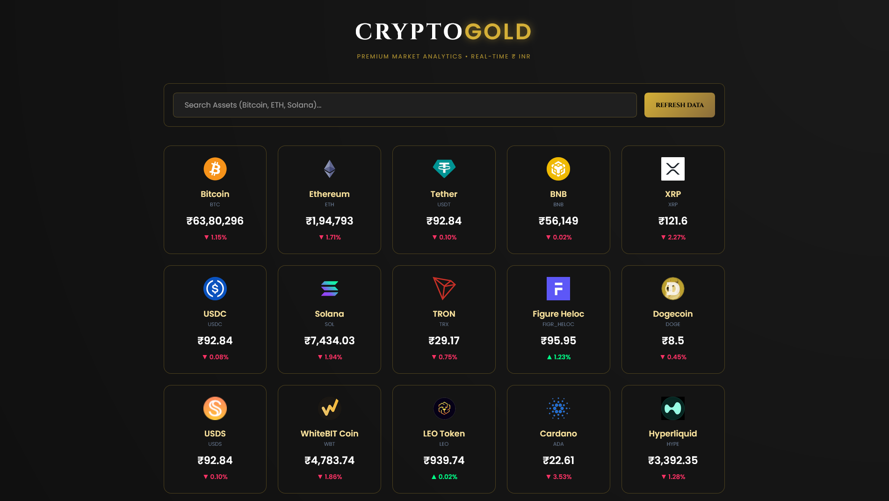
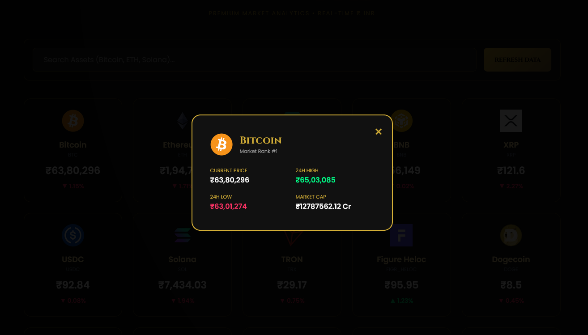
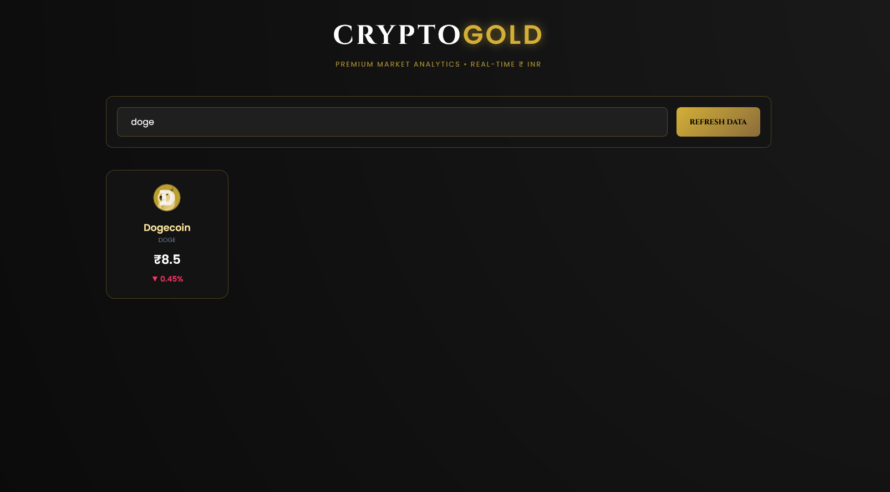

# CryptoGold Premium Market Watch 🪙✨

**[👑 View Live Dashboard: CryptoGold Market](https://mayankpatel972.github.io/Real-Time-Stock-Watchlist/)** 

> A high-end, real-time cryptocurrency analytics dashboard built with Vanilla JavaScript and the CoinGecko API. 

CryptoGold provides a luxury interface for tracking the world's leading digital assets in **Indian Rupees (₹)**. This project demonstrates advanced asynchronous data fetching, a highly responsive grid architecture, and interactive modal state management.

## 📸 Project Gallery

| 1. Main Market UI | 2. Asset Deep-Dive | 3. Real-Time Search |
| :---: | :---: | :---: |
|  |  |  |

## 💎 Premium Features

* **Live Market Intelligence:** Fetches real-time data for 60 global cryptocurrencies via the CoinGecko REST API.
* **Fluid Responsive Grid:** A dynamic 4-to-5 column layout that optimizes itself for desktop, tablet, and mobile viewing.
* **Interactive Gold-Panel Modals:** Click any asset to trigger a detailed popup showing 24h Highs, 24h Lows, and Market Cap in **Crores (Cr)**.
* **Zero-Latency Search:** A high-performance local filtering engine that finds assets by name or symbol instantly as you type.
* **Luxury "Black & Gold" Theme:** * **Cinzel & Poppins Typography** for a premium financial aesthetic.
    * **Glassmorphism Effects** and radial background gradients.
    * **Animated Hover States** with gold-glow borders and card-lift physics.
* **Indian Market Logic:** All values are formatted using the **Indian Numbering System (en-IN)**.

## 🛠️ Technical Deep-Dive

* **Asynchronous JS:** Leverages `async/await` and the `Fetch API` for non-blocking data retrieval.
* **State Management:** Uses a central `allCoins` array to handle search logic locally, reducing server load and improving speed.
* **Modern CSS Grid:** Implements `auto-fill` and `minmax` patterns to ensure a professional "full-screen" feel on high-resolution monitors.
* **Event Delegation:** Manages complex UI interactions including modal toggling and global window-click closing.

## 🚀 Deployment Instructions

1.  Create a new repository on GitHub.
2.  Upload `index.html`, `style.css`, and `script.js`.
3.  Upload your three screenshots as **screenshot1.png**, **screenshot2.png**, and **screenshot3.png**.
4.  Enable **GitHub Pages** in the repository settings.

## 📜 API Credit
Data provided by [CoinGecko](https://www.coingecko.com/en/api).

---
